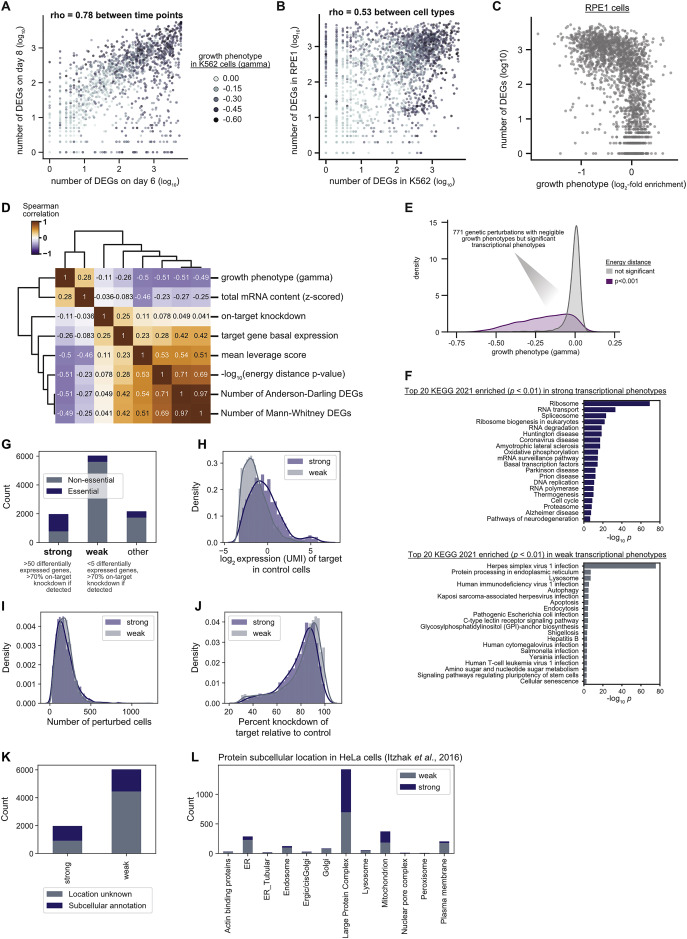

# Transcriptome Correlation and Off-Target Analysis in Perturb-seq

## Slide Deck Link
https://docs.google.com/presentation/d/1TnTIhrN0Au7cSuHHlFajkUvgd7DGEKlTrnprfuaSqYA/edit?slide=id.p#slide=id.p

## Description
Repogle et al. perform a genome-wide CRISPRi screen (Perturb-seq) to characterize the transcriptional phenotypes of all genes to predict gene function and characterize cellular functions. We aim to replicate the author's pipeline, coded in python, that they used to generate their data in R. In addition, we want to characterize off-target knockdown, using genes with bidirectional promoters as a positive control, and see how distance between genes correlate with offtarget knockdown. Finally, we hope to use the pipeline in other CRISPRi datasets, such as an astrocyte CRISPRi screen from Leng 2022, and identify unannotated genes involved in astrocyte function.

## Example Published Figure: S2, Replogle et al. 2022

## Dataset IDs:
FASTQ and BAM:

Raw Data: https://www.ncbi.nlm.nih.gov/bioproject/PRJNA831566

Metadata: https://plus.figshare.com/articles/dataset/_Mapping_information-rich_genotype-phenotype_landscapes_with_genome-scale_Perturb-seq_Replogle_et_al_2022_SRA_and_GEO_file_manifest/20022944 

Database for stretch goal: https://thebiogrid.org/

## Software:
- Python 2.7
    - PerturbSeq Library: https://github.com/thomasmaxwellnorman/Perturbseq_GI/tree/master
- R 4.2.2
    - write PerturbSeq library in R
    - adapt TAPseq 1.21.0 (Bioconductor): https://www.bioconductor.org/packages/devel/bioc/html/TAPseq.html
    - Mixscale for PerturbSeq analysis: directions https://satijalab.github.io/Mixscale/
- CellRanger 4.0.0 : https://www.10xgenomics.com/support

## Goals:

1. Recreate data-containing figures/panels from Replogle et al. 2022 (15 figures: 7 main text, 8 supplemental) using R
    - Code from paper is developed in python
2. Correlate distance between genes and determine off target KD potential of paired genes
    - Start with bidirectional promoters and look for off-target KD
    - See if KD genes have correlated transcriptome readouts
    - Assign function to unannotated genes
3. (Stretch) Use raw data from CRISPR/CRISPRi screens and pipeline generated for figure recreation to map genotype-phenotype landscapes in astrocytes with PerturbSeq
    - Potentially follow-up with transcriptome mapping

## References:
Leng, Kun, Indigo V. L. Rose, Hyosung Kim, et al. 2022. “CRISPRi Screens in Human iPSC-Derived Astrocytes Elucidate Regulators of Distinct Inflammatory Reactive States.” Nature Neuroscience 25 (11): 1528–42. https://doi.org/10.1038/s41593-022-01180-9.

Replogle, Joseph M., Reuben A. Saunders, Angela N. Pogson, et al. 2022. “Mapping Information-Rich Genotype-Phenotype Landscapes with Genome-Scale Perturb-Seq.” Cell 185 (14): 2559-2575.e28. https://doi.org/10.1016/j.cell.2022.05.013.
